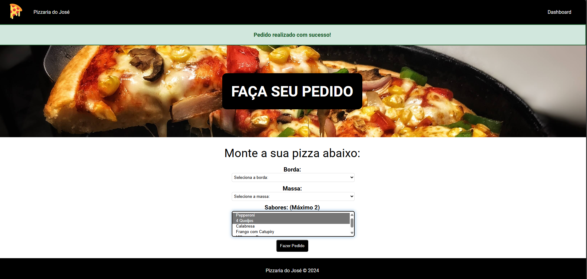
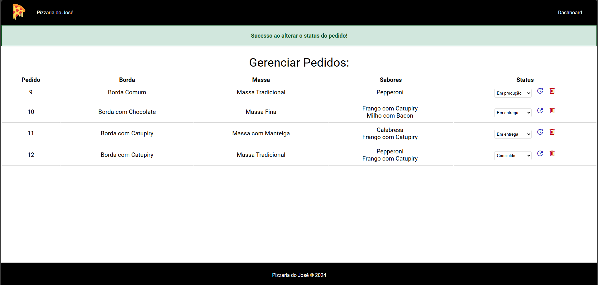

# Pizzaria do José

Pizzaria do José é um projeto desenvolvido em PHP e SQL, com HTML/CSS para a interface. O objetivo é permitir que clientes façam pedidos de pizza online, escolhendo o tipo de borda, massa e até dois sabores diferentes. Além disso, há um dashboard para a empresa gerenciar e atualizar os pedidos.

## Prints do Projeto

### Área do Cliente


### Visão da Empresa



## Funcionalidades

### Cliente
- Escolha do tipo de borda
- Escolha do tipo de massa
- Seleção de até dois sabores de pizza
- Finalização do pedido

### Empresa
- Visualização de pedidos
- Atualização do status dos pedidos (em produção, em entrega, concluído)
- Remoção de pedidos do sistema

## Tecnologias Utilizadas
- PHP (PDO)
- SQL e MYSQL
- HTML/CSS

## Instalação

1. Clone o repositório para o seu servidor local:
    ```sh
    git clone https://github.com/JoseClaudiolima/PizzariaJose
    ```

2. Importe o banco de dados a partir do arquivo `pizza_database.sql` incluído no repositório.

3. Configure o arquivo `conn.php` com as informações do seu banco de dados.

4. Abra o projeto em seu navegador web.


## Licença

Este projeto está licenciado sob a [MIT License](LICENSE).
